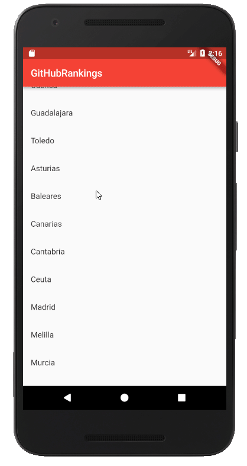

# GitHubRankings Spain - Mobile

**IMPORTANT**: this is a work in progress application done by a newbie in
[Flutter](https://flutter.io/). I am learning so... help me to learn!

## What is this repository?

This repository shows, in a nice way, the information from the repository
[GitHub Rankings Spain](ttps://github.com/iblancasa/GitHubRankingsSpain).
This repository contains a set of rankings generated by city and region.

**What kind of rankings?**: It sorts GitHub users by the number of **public
contributions** and groups them by the location in their profile. You can learn
more about the rankings in these repositories:

* [GitHubCity](https://github.com/iblancasa/GitHubCity): library to generate your own rankings
* [GitHub Spanish Ranking Generator](https://github.com/iblancasa/GitHubSpanishRankingGenerator): build system of the Spanish rankings
* [GitHub Rankings Spain](https://github.com/iblancasa/GitHubRankingsSpain): GitHub Spanish ranking dataset

## How can I build this application?

It works using [Flutter](https://flutter.io/). So, you only need to install the
Flutter SDK and... :tada::tada:

## License

Copyright (c) 2018 Israel Blancas @iblancasa (http://iblancasa.com/)

Permission is hereby granted, free of charge, to any person obtaining a copy of
this software and associated documentation files (the “Software”), to deal in
the Software without restriction, including without limitation the rights to
use, copy, modify, merge, publish, distribute, sublicense, and/or sell copies
of the Software, and to permit persons to whom the Software is furnished to do
so, subject to the following conditions:

The above copyright notice and this permission notice shall be included in all
copies or substantial portions of the Software.

THE SOFTWARE IS PROVIDED “AS IS”, WITHOUT WARRANTY OF ANY KIND, EXPRESS OR
IMPLIED, INCLUDING BUT NOT LIMITED TO THE WARRANTIES OF MERCHANTABILITY,
FITNESS FOR A PARTICULAR PURPOSE AND NONINFRINGEMENT. IN NO EVENT SHALL THE
AUTHORS OR COPYRIGHT HOLDERS BE LIABLE FOR ANY CLAIM, DAMAGES OR OTHER
LIABILITY, WHETHER IN AN ACTION OF CONTRACT, TORT OR OTHERWISE, ARISING FROM,
OUT OF OR IN CONNECTION WITH THE SOFTWARE OR THE USE OR OTHER DEALINGS
IN THE SOFTWARE.